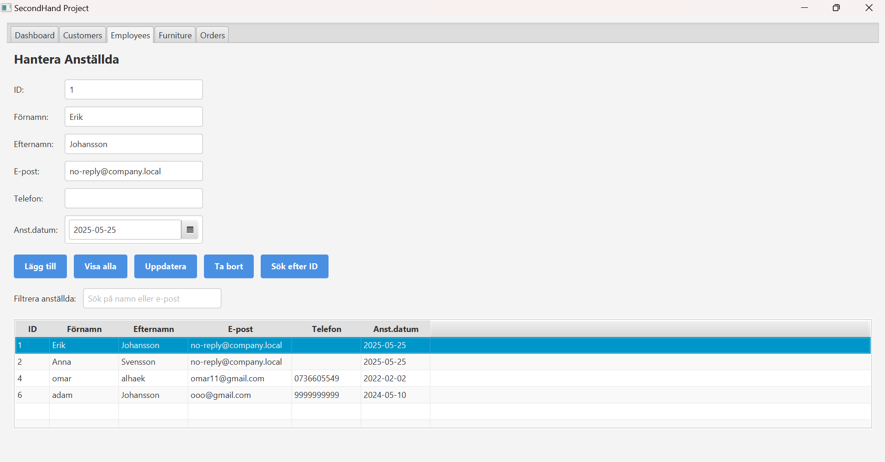

# SecondHandProject

A JavaFX-based application for managing a second-hand furniture store. The application provides a graphical user interface (GUI) for handling customer management, furniture inventory, order processing, and employee order tracking. It features robust error handling, input validation, and database integration with MySQL.

---

## Features

- **Customer Management**  
  Add, update, delete, and view customers with details like first name, last name, email, and phone.  
- **Furniture Inventory**  
  Add, update, delete, and view furniture items, including name, color, comment, price, purchase date, shelf number, and weight.  
- **Order Processing**  
  Create, delete, and view orders with order lines, including furniture items and quantities.  
- **Employee Order Tracking**  
  View orders by employee, including customer names, detailed order information, and total order value.  
- **Search and Filter**  
  Search customers, furniture, or orders by ID, and filter lists by relevant fields (e.g., name, color, customer ID).  
- **Graphical User Interface**  
  Intuitive JavaFX GUI with styled components, tooltips, and real-time input validation.  
- **Database Integration**  
  Persistent storage using MySQL, configured via `db.properties`.  
- **Logging**  
  File-based logging for debugging and error tracking.  
- **Error Handling**  
  Robust input validation and user-friendly error messages in the GUI.  

---

## Project Structure

- **src/**
  - **main/**
    - **java/**
      - **org/example/**
        - App.java
        - CustomerController.java
        - EmployeeController.java
        - FurnitureController.java
        - OrderController.java
        - OrderDetail.java
        - OrderHead.java
        - OrderLine.java
        - Customer.java
        - Employee.java
        - Furniture.java
        - CustomerDao.java
        - EmployeeDao.java
        - FurnitureDao.java
        - OrderDao.java
        - DatabaseConfig.java
    - **resources/**
      - **org/example/**
        - main.fxml
        - customer.fxml
        - employee.fxml
        - furniture.fxml
        - order.fxml
        - style.css
      - schema.sql
      - db.properties
- pom.xml
- README.md
- LICENSE

```

## Setup

1. **Clone the repository**  
   ```bash
   git clone https://github.com/<your-username>/SecondHandProject.git
   cd SecondHandProject
````

2. **Set up MySQL database**

  * Install MySQL and create a database (e.g., `furniture_db`).
  * Run the SQL script to create the tables:

    ```bash
    mysql -u <your_username> -p furniture_db < src/main/resources/schema.sql
    ```

3. **Configure `db.properties`**
   Edit `src/main/resources/db.properties` with your credentials:

   ```properties
   db.url=jdbc:mysql://localhost:3306/furniture_db
   db.username=<your_username>
   db.password=<your_password>
   db.driver=com.mysql.cj.jdbc.Driver
   ```

   > **Tip:** Add `db.properties` to `.gitignore` if it contains sensitive info.

4. **Build the project**
   Ensure you have Java 23 and Maven installed, then:

   ```bash
   mvn clean install
   ```

5. **Run the application**

  * As a jar:

    ```bash
    java -jar target/SecondHandProject-1.0-SNAPSHOT.jar
    ```
  * Or directly with Maven:

    ```bash
    mvn javafx:run
    ```

---

## Dependencies

Defined in `pom.xml`:

```xml
<dependencies>
  <dependency>
    <groupId>org.openjfx</groupId>
    <artifactId>javafx-controls</artifactId>
    <version>23</version>
  </dependency>
  <dependency>
    <groupId>org.openjfx</groupId>
    <artifactId>javafx-fxml</artifactId>
    <version>23</version>
  </dependency>
  <dependency>
    <groupId>mysql</groupId>
    <artifactId>mysql-connector-java</artifactId>
    <version>9.3.0</version>
  </dependency>
</dependencies>
```

---

## Usage

1. **Launch the app**
2. **Navigate tabs**

  * **Home**: Overview or dashboard
  * **Customers**: Manage customer records
  * **Employees**: Manage employee records
  * **Furniture**: Manage inventory
  * **Orders**: Create/manage orders with order lines
3. **Interact**

  * Add/update/delete records with the GUI buttons
  * Use filters or dialog inputs to search by ID or other fields
  * View detailed order summaries and totals



---

## Notes

* **Database**: Ensure MySQL server is running before launch.
* **JavaFX**: Requires JavaFX SDK and proper Maven plugin (`javafx-maven-plugin`).
* **Logging**: Logs go to a file; configure in your DAO classes if needed.
* **Security**: Don’t store sensitive credentials in `db.properties` for production—consider environment variables or a secure vault.

---

## License

This project is licensed under the MIT License. See the [LICENSE](LICENSE) file for details.

---

## Contributing

Contributions are welcome!

1. Fork the repo
2. Create a feature branch (`git checkout -b feature/YourFeature`)
3. Commit your changes (`git commit -m 'Add some feature'`)
4. Push to the branch (`git push origin feature/YourFeature`)
5. Open a Pull Request

Please follow the existing code style and include tests where applicable.

---

## Contact

For questions or issues, please open an issue on GitHub or contact:
**[omaralhaek97@gmail.com](mailto:omaralhaek97@gmail.com)**

```
```
